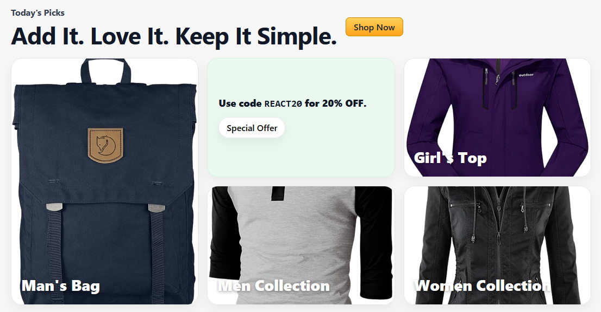
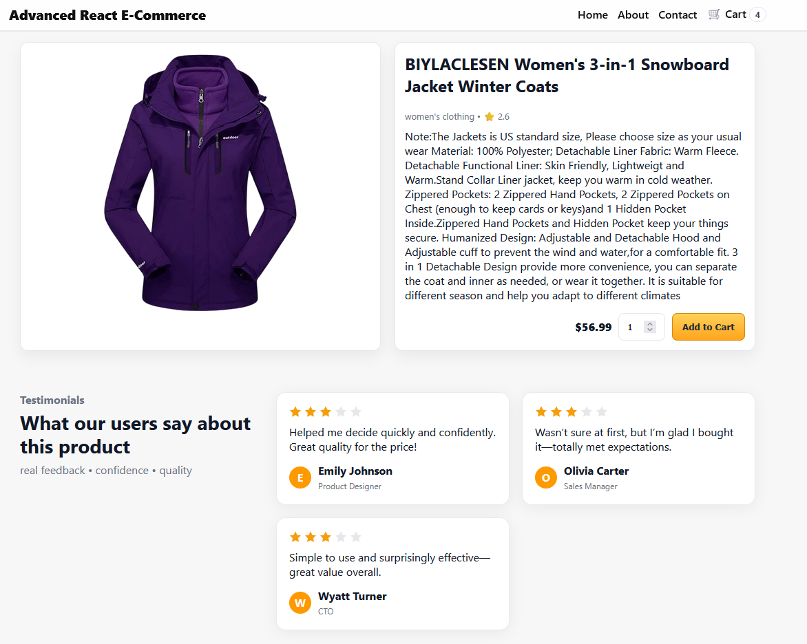
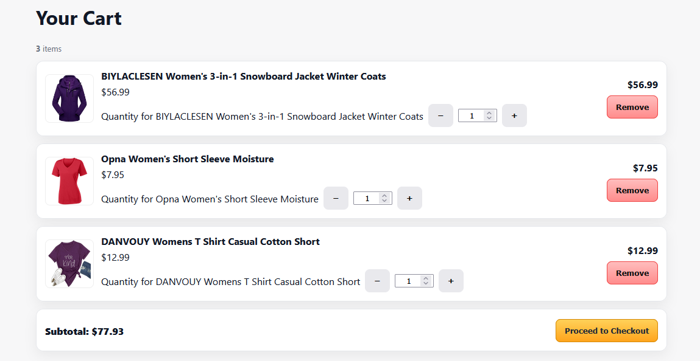

# 🛍️ Advanced Shop - Full-Stack E-Commerce Platform

**Version 1.0.0** - Production Release

[](https://github.com/growthwithcoding)
[](CHANGELOG.md)
[](https://react.dev/)
[](https://vitejs.dev/)
[](https://firebase.google.com/)
[](https://tailwindcss.com/)
[](https://redux-toolkit.js.org/)
[](LICENSE)

A modern, feature-rich e-commerce platform built with React 19 and Firebase. Features comprehensive admin dashboard, real-time analytics, support ticket system, and seamless checkout experience.

**🎉 Version 1.0.0 Release** - This is the first official production-ready version. See [CHANGELOG.md](CHANGELOG.md) for details.

---

## 📖 Overview

**Advanced Shop** is a professional-grade e-commerce web application designed for both customers and administrators. Built with cutting-edge technologies, it provides a complete solution for online retail operations including product management, order processing, customer support, and business analytics.

**Target Users:**
- 🛒 **Customers** - Browse products, manage orders, track shipments
- 👔 **Administrators** - Manage inventory, process orders, view analytics
- 🎧 **Support Agents** - Handle customer tickets and inquiries

**Key Functionality:**
- Real-time product catalog with advanced search and filtering
- Secure authentication with Firebase (Email/Password + Google OAuth)
- Shopping cart with persistent state management
- Multi-step checkout with address and payment handling
- Comprehensive admin dashboard with KPIs and visualizations
- Support ticket system with priority tracking
- Discount code management and application
- Order fulfillment tracking

---

## ✨ Feature Highlights

### 🛍️ Customer Experience
- **Product Catalog** - Browse products with search, category filters, and sorting ([`src/pages/Home.jsx`](src/pages/Home.jsx))
- **Product Details** - Detailed product views with images, ratings, and inventory status ([`src/pages/ProductPage.jsx`](src/pages/ProductPage.jsx))
- **Shopping Cart** - Persistent cart with quantity management ([`src/components/Cart.jsx`](src/components/Cart.jsx), [`src/features/cart/cartSlice.js`](src/features/cart/cartSlice.js))
- **Secure Checkout** - Multi-step checkout with address and payment validation ([`src/pages/CheckoutPage.jsx`](src/pages/CheckoutPage.jsx))
- **Order Tracking** - View order history and shipment status ([`src/pages/Orders.jsx`](src/pages/Orders.jsx), [`src/pages/OrderDetail.jsx`](src/pages/OrderDetail.jsx))
- **User Profiles** - Manage addresses, payment methods, and account settings ([`src/pages/Profile.jsx`](src/pages/Profile.jsx))
- **Discount Codes** - Apply promotional codes at checkout ([`src/services/discountService.jsx`](src/services/discountService.jsx))

### 👨‍💼 Admin & Agent Features
- **Admin Dashboard** - Comprehensive analytics with revenue tracking, order metrics, and inventory insights ([`src/pages/AdminDashboard.jsx`](src/pages/AdminDashboard.jsx))
- **Product Management** - Add, edit, delete products with inventory control ([`src/pages/AdminProducts.jsx`](src/pages/AdminProducts.jsx))
- **Order Management** - Process orders, update fulfillment status ([`src/pages/AdminOrders.jsx`](src/pages/AdminOrders.jsx))
- **User Management** - View and manage customer accounts ([`src/pages/AdminUsers.jsx`](src/pages/AdminUsers.jsx))
- **Discount Administration** - Create and manage promotional campaigns ([`src/pages/AdminDiscounts.jsx`](src/pages/AdminDiscounts.jsx))
- **Store Settings** - Configure store details, support hours, and contact information ([`src/pages/AdminSettings.jsx`](src/pages/AdminSettings.jsx))
- **Support Ticket System** - Track and respond to customer inquiries ([`src/components/CreateSupportTicketModal.jsx`](src/components/CreateSupportTicketModal.jsx))

### 📊 Analytics & Insights
- **Revenue Tracking** - Real-time revenue targets and performance charts ([`src/components/dashboard/Charts.jsx`](src/components/dashboard/Charts.jsx))
- **Conversion Funnels** - Visualize customer journey from browsing to purchase
- **Product Performance** - Pareto analysis for top-selling products
- **Inventory Management** - Aging reports and turnover metrics
- **Support Metrics** - Ticket backlog and agent workload tracking
- **Interactive Visualizations** - Powered by Recharts with heatmaps, gauges, and waterfalls

### 🔐 Authentication & Security
- **Firebase Authentication** - Secure user management ([`src/lib/firebase.js`](src/lib/firebase.js))
- **Google OAuth** - One-click sign-in with Google accounts ([`src/auth/AuthProvider.jsx`](src/auth/AuthProvider.jsx))
- **Role-Based Access Control** - Admin, agent, and customer roles ([`src/auth/AdminRoute.jsx`](src/auth/AdminRoute.jsx), [`src/auth/AgentRoute.jsx`](src/auth/AgentRoute.jsx))
- **Protected Routes** - Secure pages requiring authentication ([`src/auth/ProtectedRoute.jsx`](src/auth/ProtectedRoute.jsx))

### 🎯 Additional Features
- **First-Run Onboarding** - WordPress-style setup wizard for initial configuration ([`src/pages/Onboarding.jsx`](src/pages/Onboarding.jsx))
- **Email Notifications** - Order confirmations and support updates via EmailJS ([`src/pages/Contact.jsx`](src/pages/Contact.jsx))
- **Responsive Design** - Mobile-first UI with Tailwind CSS
- **Dark Mode Support** - Theme switching capabilities
- **Real-time Updates** - Live data synchronization with Firestore
- **Search & Filtering** - Multi-tier search with relevance ranking ([`src/utils/search.js`](src/utils/search.js))
- **Keyboard Shortcuts** - Power user features ([`src/hooks/useKeyboardShortcuts.js`](src/hooks/useKeyboardShortcuts.js))

---

## 🛠️ Tech Stack

### Frontend


### Backend & Database


### Libraries & Tools


### Development Tools


---

## 📂 File Structure

```
advanced-shop-FB-Edition/
├── public/                          # Static assets
│   ├── logos/                       # Technology logos
│   ├── products/                    # Product images
│   └── screenshots/                 # App screenshots
├── src/
│   ├── app/
│   │   └── store.js                 # Redux store configuration
│   ├── auth/                        # Authentication components
│   │   ├── AdminRoute.jsx           # Admin route protection
│   │   ├── AgentRoute.jsx           # Agent route protection
│   │   ├── AuthProvider.jsx         # Auth context provider
│   │   ├── ProtectedRoute.jsx       # General route protection
│   │   └── useAuth.js               # Auth custom hook
│   ├── components/                  # Reusable UI components
│   │   ├── dashboard/               # Dashboard-specific components
│   │   │   ├── AttentionCard.jsx    # Alert cards for admin
│   │   │   ├── Charts.jsx           # Analytics visualizations
│   │   │   ├── GlobalFiltersBar.jsx # Date/filter controls
│   │   │   ├── KpiCard.jsx          # Key performance indicators
│   │   │   ├── OrdersTable.jsx      # Order listing table
│   │   │   └── TicketsKanban.jsx    # Support ticket board
│   │   ├── AddAddressModal.jsx      # Address management
│   │   ├── AddPaymentModal.jsx      # Payment method management
│   │   ├── AddToCartModal.jsx       # Cart confirmation modal
│   │   ├── AdminUserModal.jsx       # User detail modal
│   │   ├── BackToTop.jsx            # Scroll to top button
│   │   ├── Cart.jsx                 # Shopping cart component
│   │   ├── CategorySelect.jsx       # Category dropdown
│   │   ├── CreateSupportTicketModal.jsx # Ticket creation
│   │   ├── EditProfileModal.jsx     # Profile editing
│   │   ├── EditTicketModal.jsx      # Ticket editing
│   │   ├── Footer.jsx               # Site footer
│   │   ├── Hero.jsx                 # Homepage hero section
│   │   ├── InventoryTrendGraph.jsx  # Inventory visualization
│   │   ├── NavBar.jsx               # Main navigation
│   │   ├── ProductCard.jsx          # Product display card
│   │   ├── ScrollToTop.jsx          # Route scroll utility
│   │   ├── SearchBar.jsx            # Product search
│   │   ├── SortControl.jsx          # Product sorting
│   │   ├── Testimonials.jsx         # Customer testimonials
│   │   └── ZipModal.jsx             # Zip code modal
│   ├── contexts/
│   │   └── DashboardContext.jsx     # Dashboard state management
│   ├── data/
│   │   └── testimonials.json        # Testimonial data
│   ├── features/                    # Redux feature slices
│   │   ├── cart/
│   │   │   ├── cartSlice.js         # Cart state management
│   │   │   └── selectors.js         # Cart selectors
│   │   └── ui/
│   │       └── uiSlice.js           # UI state management
│   ├── hooks/                       # Custom React hooks
│   │   ├── useDashboard.js          # Dashboard data hook
│   │   └── useKeyboardShortcuts.js  # Keyboard shortcut handler
│   ├── lib/
│   │   ├── firebase.js              # Firebase configuration
│   │   └── utils.js                 # Utility functions
│   ├── pages/                       # Application pages
│   │   ├── About.jsx                # About page
│   │   ├── AdminDashboard.jsx       # Admin analytics dashboard
│   │   ├── AdminDiscounts.jsx       # Discount management
│   │   ├── AdminOrders.jsx          # Order management
│   │   ├── AdminProducts.jsx        # Product management
│   │   ├── AdminSettings.jsx        # Store settings
│   │   ├── AdminUsers.jsx           # User management
│   │   ├── AuthPage.jsx             # Login/signup
│   │   ├── CartPage.jsx             # Shopping cart page
│   │   ├── CheckoutPage.jsx         # Checkout process
│   │   ├── Contact.jsx              # Contact/help center
│   │   ├── Dashboard.jsx            # User dashboard
│   │   ├── Home.jsx                 # Homepage/catalog
│   │   ├── Onboarding.jsx           # First-run setup wizard
│   │   ├── OrderConfirmation.jsx    # Order success page
│   │   ├── OrderDetail.jsx          # Order details
│   │   ├── Orders.jsx               # Order history
│   │   ├── ProductPage.jsx          # Product details
│   │   └── Profile.jsx              # User profile
│   ├── services/                    # Business logic services
│   │   ├── addressService.js        # Address CRUD
│   │   ├── contentService.js        # Content management
│   │   ├── discountService.jsx      # Discount logic
│   │   ├── onboardingService.js     # Onboarding state
│   │   ├── orderService.js          # Order operations
│   │   ├── paymentMethodService.js  # Payment methods
│   │   ├── paymentService.jsx       # Payment processing
│   │   ├── productService.js        # Product operations
│   │   ├── settingsService.jsx      # Store settings
│   │   ├── ticketService.js         # Support tickets
│   │   └── userService.js           # User operations
│   ├── utils/                       # Helper utilities
│   │   ├── money.js                 # Currency formatting
│   │   └── search.js                # Search algorithms
│   ├── App.jsx                      # Main app component
│   ├── index.css                    # Global styles
│   ├── main.jsx                     # App entry point
│   └── styles.css                   # Additional styles
├── store-seeder/                    # Database seeding tools
│   ├── discountsSeed.json           # Sample discount data
│   ├── ordersSeed.json              # Sample order data
│   ├── productSeed.json             # Sample product data
│   ├── usersSeed.json               # Sample user data
│   ├── seed-store.mjs               # Seeder script
│   └── README.md                    # Seeder documentation
├── .firebaserc                      # Firebase project config
├── firebase.json                    # Firebase hosting config
├── firestore.rules                  # Security rules
├── ONBOARDING.md                    # Onboarding guide
├── package.json                     # Dependencies
├── postcss.config.js                # PostCSS configuration
├── tailwind.config.js               # Tailwind configuration
└── vite.config.js                   # Vite configuration
```

---

## 🚀 Quick Start

### Prerequisites
- Node.js 18+ and npm
- Firebase account ([Create one here](https://console.firebase.google.com))
- Git

### Installation

```bash
# 1. Clone the repository
git clone https://github.com/growthwithcoding/React-Shop-FB.git
cd React-Shop-FB

# 2. Install dependencies
npm install
```

### Firebase Setup

1. **Create a Firebase Project**
   - Go to [Firebase Console](https://console.firebase.google.com)
   - Click "Add Project" and follow the setup wizard
   - Enable Google Analytics (optional)

2. **Enable Authentication**
   - Navigate to Authentication > Sign-in method
   - Enable "Email/Password" provider
   - Enable "Google" provider (add your support email)

3. **Create Firestore Database**
   - Navigate to Firestore Database
   - Click "Create Database"
   - Start in **production mode**
   - Choose a location close to your users

4. **Configure Environment Variables**
   
   Create a `.env` file in the project root (this file is gitignored):
   
   ```env
   VITE_FIREBASE_API_KEY=your_api_key_here
   VITE_FIREBASE_AUTH_DOMAIN=your_project.firebaseapp.com
   VITE_FIREBASE_PROJECT_ID=your_project_id
   VITE_FIREBASE_STORAGE_BUCKET=your_project.appspot.com
   VITE_FIREBASE_MESSAGING_SENDER_ID=your_sender_id
   VITE_FIREBASE_APP_ID=your_app_id
   VITE_FIREBASE_MEASUREMENT_ID=your_measurement_id
   ```
   
   Find these values in Firebase Console > Project Settings > Your apps > SDK setup and configuration

5. **Deploy Firestore Security Rules**
   
   ```bash
   npm install -g firebase-tools
   firebase login
   firebase init firestore  # Select existing project
   firebase deploy --only firestore:rules
   ```

### Running the Application

**🎯 Easiest Way - Automatic Detection:**
```bash
npm run setup
```
This smart command:
- ✅ Checks if your .env file exists
- ✅ Automatically starts the correct server(s)
- ✅ If no .env: Starts both servers for onboarding
- ✅ If .env exists: Starts only Vite dev server

**Manual Options:**

**First Time Setup (No .env file yet):**
```bash
npm run dev:full
```
Starts both:
- Vite dev server (port 5173)
- Express onboarding server (port 3001)
- Allows automatic .env file creation through the UI

**After Setup (.env file exists):**
```bash
npm run dev
```
Starts only Vite - that's all you need once configured!

App opens at http://localhost:5173

### First-Run Setup

On first launch (when no `.env` file exists), you'll be redirected to the **onboarding wizard** (`/onboarding`):

1. **Firebase Configuration** - Validates or helps create your .env file
2. **Admin Account** - Create your administrator account
3. **Store Settings** - Configure store name, email, support hours
4. **Database Seeding** - Optionally populate with sample data
5. **Complete** - Finish setup and start using the store

**Important:** Make sure you started with `npm run dev:full` for the first run so the Express server can help create your .env file automatically.

For detailed onboarding instructions, see [`ONBOARDING.md`](ONBOARDING.md) and [`ONBOARDING_SERVER.md`](ONBOARDING_SERVER.md).

### Database Seeding (Optional but Recommended)

To populate your store with comprehensive test data including products, orders, users, support tickets, and more:

#### Quick Start

```bash
cd seeding
npm install
```

#### Step 1: Get Firebase Service Account Key

1. Go to [Firebase Console](https://console.firebase.google.com)
2. Select your project
3. Navigate to **Project Settings** (gear icon) → **Service Accounts**
4. Click **"Generate New Private Key"**
5. Save the downloaded JSON file as `firebase-admin.json` in the `seeding/` directory

#### Step 2: Create Master Seeding Script

**Option A: Use the Comprehensive Guide** (Recommended)

See [seeding/SEEDING_GUIDE.md](seeding/SEEDING_GUIDE.md) for the complete master seeding script with all collections.

**Option B: Quick Script Template**

If you prefer to create your own, here's a template for `seed-all.mjs`:

```javascript
import admin from "firebase-admin";
import { readFile } from "fs/promises";

// Initialize Firebase Admin
const serviceAccount = JSON.parse(
  await readFile(new URL("./firebase-admin.json", import.meta.url))
);

admin.initializeApp({
  credential: admin.credential.cert(serviceAccount)
});

const db = admin.firestore();

console.log("🚀 Starting comprehensive database seeding...\n");

// Helper function to seed a collection
async function seedCollection(collectionName, dataFile, options = {}) {
  const { useIdAsDocId = false, docId = null } = options;
  
  console.log(`📦 Seeding ${collectionName}...`);
  
  const data = JSON.parse(
    await readFile(new URL(`./${dataFile}`, import.meta.url))
  );
  
  if (docId) {
    await db.collection(collectionName).doc(docId).set(data);
    console.log(`✅ ${collectionName}/${docId} created\n`);
    return;
  }
  
  const batch = db.batch();
  let count = 0;
  
  for (const item of data) {
    const id = useIdAsDocId ? item.id || item.userId || item.sku || item.orderId : null;
    const ref = id 
      ? db.collection(collectionName).doc(id)
      : db.collection(collectionName).doc();
    
    const processedItem = { ...item };
    if (collectionName === 'products') {
      processedItem.createdAt = admin.firestore.FieldValue.serverTimestamp();
      processedItem.updatedAt = admin.firestore.FieldValue.serverTimestamp();
    }
    
    batch.set(ref, processedItem, { merge: true });
    count++;
  }
  
  await batch.commit();
  console.log(`✅ ${collectionName}: ${count} documents created\n`);
}

// Seed in correct order
async function seedAll() {
  try {
    await seedCollection("system", "systemSeed.json", { docId: "setup" });
    await seedCollection("settings", "settingsSeed.json", { docId: "default" });
    await seedCollection("users", "usersEnhancedSeed.json", { useIdAsDocId: true });
    await seedCollection("products", "productSeed.json", { useIdAsDocId: true });
    await seedCollection("orders", "ordersSeed.json", { useIdAsDocId: true });
    await seedCollection("discounts", "discountsSeed.json", { useIdAsDocId: true });
    await seedCollection("supportTickets", "supportTicketsSeed.json", { useIdAsDocId: true });
    await seedCollection("ticketReplies", "ticketRepliesSeed.json", { useIdAsDocId: true });
    
    console.log("🎉 Database seeding completed successfully!");
    console.log("\n📊 Summary:");
    console.log("  • 13 Users (1 admin, 2 agents, 10 customers)");
    console.log("  • 27 Products");
    console.log("  • 30 Orders");
    console.log("  • 15 Discounts");
    console.log("  • 15 Support tickets");
    console.log("  • 29 Ticket replies");
    console.log("\n✨ Your database is ready for testing!");
  } catch (error) {
    console.error("❌ Seeding failed:", error);
    process.exit(1);
  }
}

seedAll().then(() => process.exit(0));
```

#### Step 3: Run Seeding Script

```bash
node seed-all.mjs
```

#### Step 4: Create Authentication Accounts

**Important:** After seeding Firestore data, you must create Firebase Authentication accounts for users to log in.

Create `create-auth-users.mjs`:

```javascript
import admin from "firebase-admin";
import { readFile } from "fs/promises";

const serviceAccount = JSON.parse(
  await readFile(new URL("./firebase-admin.json", import.meta.url))
);

admin.initializeApp({
  credential: admin.credential.cert(serviceAccount)
});

const users = JSON.parse(
  await readFile(new URL("./usersEnhancedSeed.json", import.meta.url))
);

async function createAuthUsers() {
  for (const user of users) {
    try {
      await admin.auth().createUser({
        uid: user.userId,
        email: user.email,
        password: "TestPass123!",  // Change this to a secure password!
        displayName: user.name
      });
      console.log(`✅ Created auth user: ${user.email}`);
    } catch (error) {
      if (error.code === 'auth/uid-already-exists') {
        console.log(`⚠️  User already exists: ${user.email}`);
      } else {
        console.error(`❌ Failed to create ${user.email}:`, error.message);
      }
    }
  }
}

createAuthUsers().then(() => process.exit(0));
```

Run:
```bash
node create-auth-users.mjs
```

#### Test Accounts

After seeding, you can log in with these accounts (password: `TestPass123!` or what you set):

- **Admin:** admin@advancedshop.com
- **Agent 1:** sarah.johnson@advancedshop.com
- **Agent 2:** michael.chen@advancedshop.com
- **Customer:** gm@eimutah.com (+ 9 more customers)

#### What Gets Seeded

The seeding process populates your database with:

- ✅ **130 documents** across 8 Firestore collections
- ✅ **Complete user profiles** with addresses and payment methods
- ✅ **Product catalog** (27 products with inventory)
- ✅ **Order history** (30 orders in various states)
- ✅ **Discount codes** (15 promotional codes)
- ✅ **Support ticket system** (15 tickets + 29 threaded replies)
- ✅ **Store settings** and system configuration

#### Detailed Documentation

For comprehensive seeding documentation including:
- Complete schema reference for all collections
- User journey testing scenarios
- Edge case coverage
- Troubleshooting guide
- Data cleanup procedures

**See:** [seeding/SEEDING_GUIDE.md](seeding/SEEDING_GUIDE.md)

For a complete coverage checklist of all features and data:

**See:** [seeding/SEED_DATA_SUMMARY.md](seeding/SEED_DATA_SUMMARY.md)

---

## 📧 EmailJS Setup

The application uses EmailJS for transactional emails (order confirmations, support tickets).

### Configuration Steps

1. **Create EmailJS Account**
   - Sign up at [EmailJS.com](https://www.emailjs.com/)
   - Create a new email service (Gmail, Outlook, etc.)

2. **Create Email Templates**
   - Create templates for order confirmations
   - Create templates for support tickets
   - Note your Template IDs

3. **Update Email Service**
   
   In [`src/pages/Contact.jsx`](src/pages/Contact.jsx) and [`src/pages/CheckoutPage.jsx`](src/pages/CheckoutPage.jsx), update:
   
   ```javascript
   emailjs.send(
     "your_service_id",      // Replace with your EmailJS service ID
     "your_template_id",     // Replace with your template ID
     templateParams,
     "your_public_key"       // Replace with your EmailJS public key
   )
   ```

### Environment Variables (Optional)

For better security, store EmailJS credentials in environment variables:

```env
VITE_EMAILJS_SERVICE_ID=your_service_id
VITE_EMAILJS_TEMPLATE_ID=your_template_id
VITE_EMAILJS_PUBLIC_KEY=your_public_key
```

---

## 📜 Available Scripts

| Script | Description |
|--------|-------------|
| `npm run setup` | **🎯 Recommended!** Auto-detects .env and starts the right server(s) |
| `npm run dev` | Start Vite development server (use after .env is created) |
| `npm run dev:full` | Start both Vite and Express servers (for first-time setup) |
| `npm run server` | Start only the Express onboarding server |
| `npm start` | Alias for `npm run server` |
| `npm run build` | Build production-ready bundle |
| `npm run preview` | Preview production build locally |
| `npm run lint` | Run ESLint to check code quality |

---

## 📸 Screenshots

### Homepage


### Product Catalog


### Shopping Cart


---

## 👨‍💻 Author & Links

**Austin Carlson**  
*#growthwithcoding*

[](https://github.com/growthwithcoding)
[](https://www.linkedin.com/in/austin-carlson-720b65375/)

---

## 🔮 Future Enhancements

Advanced Shop has an extensive roadmap of planned features and enhancements. For a comprehensive list of upcoming features across all categories including:

- **Customer Experience** - Product variations, reviews, wishlists, recommendations
- **Order & Fulfillment** - Advanced shipping, returns, subscriptions
- **Payment & Pricing** - Gateway integration, dynamic pricing
- **User & Marketing** - Loyalty programs, email marketing, social integration
- **Admin & Analytics** - Advanced reporting, CMS, inventory management
- **Security & Performance** - 2FA, caching, PWA capabilities
- **AI & Automation** - Chatbots, ML recommendations, fraud detection

**📋 See the complete roadmap:** [FUTURE_ENHANCEMENTS.md](FUTURE_ENHANCEMENTS.md)

---

## 🤝 Contributing

Contributions are welcome! To contribute:

1. **Fork the repository**
   ```bash
   git clone https://github.com/YOUR_USERNAME/advanced-shop-capstone.git
   ```

2. **Create a feature branch**
   ```bash
   git checkout -b feature/amazing-feature
   ```

3. **Make your changes**
   - Write clean, documented code
   - Follow existing code style
   - Test thoroughly

4. **Commit your changes**
   ```bash
   git commit -m "Add amazing feature"
   ```

5. **Push to your fork**
   ```bash
   git push origin feature/amazing-feature
   ```

6. **Open a Pull Request**
   - Describe your changes
   - Reference any related issues
   - Wait for review

### Development Guidelines

- Follow React best practices and hooks patterns
- Use TypeScript-style JSDoc comments for functions
- Maintain component modularity and reusability
- Write meaningful commit messages
- Update documentation for new features

---

## 📚 Used Libraries & Licenses

This project uses the following open-source libraries:

### Core Framework
- **React** (v19.1.1) - MIT License - UI library
- **Vite** (v7.1.6) - MIT License - Build tool and dev server

### State Management
- **Redux Toolkit** (v2.9.0) - MIT License - State management
- **React Query** (v5.89.0) - MIT License - Server state management

### Routing & Navigation
- **React Router** (v7.9.3) - MIT License - Client-side routing

### UI & Styling
- **TailwindCSS** (v3.4.18) - MIT License - Utility-first CSS framework
- **Lucide React** (v0.544.0) - ISC License - Icon library
- **FontAwesome** (v7.1.0) - MIT License - Icon library

### Backend & Database
- **Firebase** (v12.3.0) - Apache 2.0 License - Backend services
  - Firebase Authentication
  - Cloud Firestore
  - Firebase Storage

### Data Visualization
- **Recharts** (v3.2.1) - MIT License - Charting library

### Utilities
- **Axios** (v1.12.2) - MIT License - HTTP client
- **date-fns** (v4.1.0) - MIT License - Date utility library
- **EmailJS** (v3.2.0) - MIT License - Email service

### Development Tools
- **ESLint** (v9.35.0) - MIT License - Code linting
- **PostCSS** (v8.5.6) - MIT License - CSS processing
- **Autoprefixer** (v10.4.21) - MIT License - CSS vendor prefixing

All dependencies are compatible with the MIT License and can be freely used in commercial and open-source projects.

---

## 📄 License

**MIT License**

Copyright (c) 2025 Austin Carlson

Permission is hereby granted, free of charge, to any person obtaining a copy
of this software and associated documentation files (the "Software"), to deal
in the Software without restriction, including without limitation the rights
to use, copy, modify, merge, publish, distribute, sublicense, and/or sell
copies of the Software, and to permit persons to whom the Software is
furnished to do so, subject to the following conditions:

The above copyright notice and this permission notice shall be included in all
copies or substantial portions of the Software.

THE SOFTWARE IS PROVIDED "AS IS", WITHOUT WARRANTY OF ANY KIND, EXPRESS OR
IMPLIED, INCLUDING BUT NOT LIMITED TO THE WARRANTIES OF MERCHANTABILITY,
FITNESS FOR A PARTICULAR PURPOSE AND NONINFRINGEMENT. IN NO EVENT SHALL THE
AUTHORS OR COPYRIGHT HOLDERS BE LIABLE FOR ANY CLAIM, DAMAGES OR OTHER
LIABILITY, WHETHER IN AN ACTION OF CONTRACT, TORT OR OTHERWISE, ARISING FROM,
OUT OF OR IN CONNECTION WITH THE SOFTWARE OR THE USE OR OTHER DEALINGS IN THE
SOFTWARE.

---

## 🙏 Acknowledgments

- **React Team** - For the amazing React library and ecosystem
- **Firebase Team** - For the robust backend platform
- **Vercel** - For the excellent hosting and deployment experience
- **TailwindLabs** - For the utility-first CSS framework
- **Open Source Community** - For inspiration, tools, and support

---

<div align="center">

**Built with ❤️ by [Austin Carlson](https://github.com/growthwithcoding)**

⭐ Star this repo if you find it helpful!

</div>
